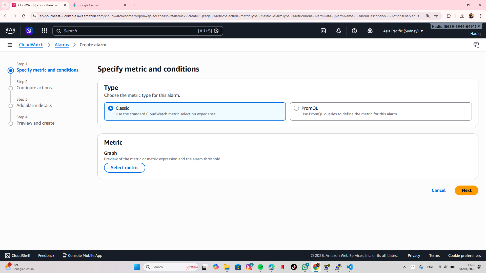
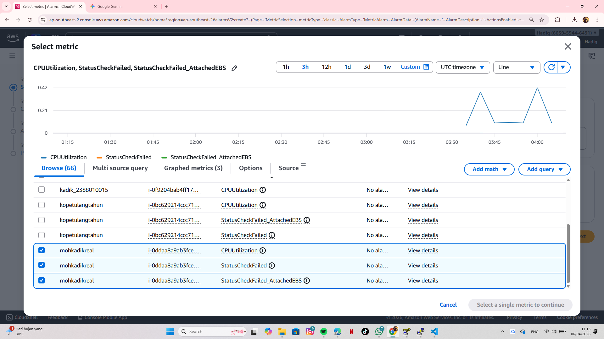
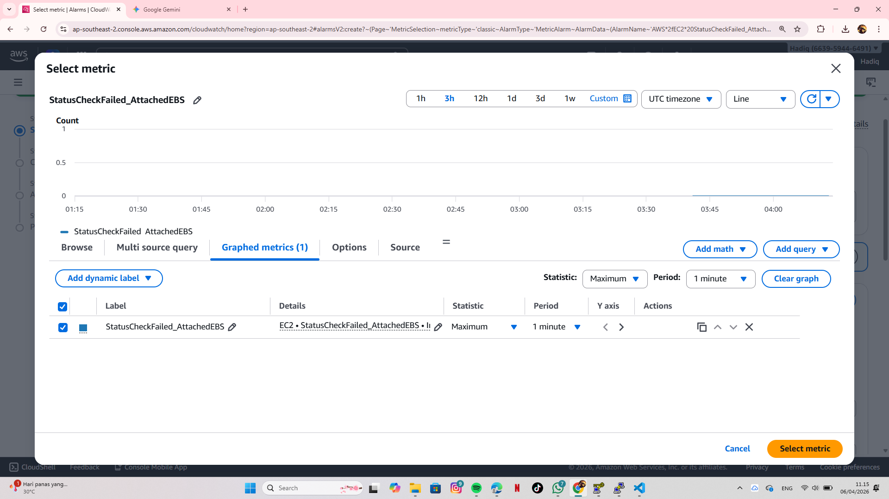
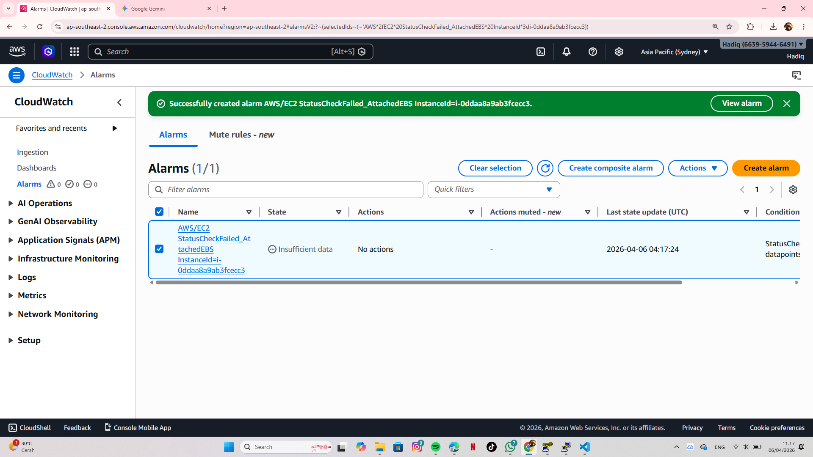

Open the CloudWatch console and select "Alarms" to create a new monitoring metric for our instance
Select the specific metric, such as CPU Utilization, and choose the EC2 instance we just created
Configure the threshold conditions, for example, setting an alarm if CPU usage exceeds 80%
Review the configuration and click "Create Alarm" to finalize the monitoring setup