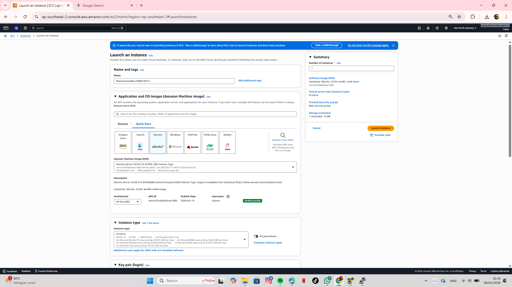
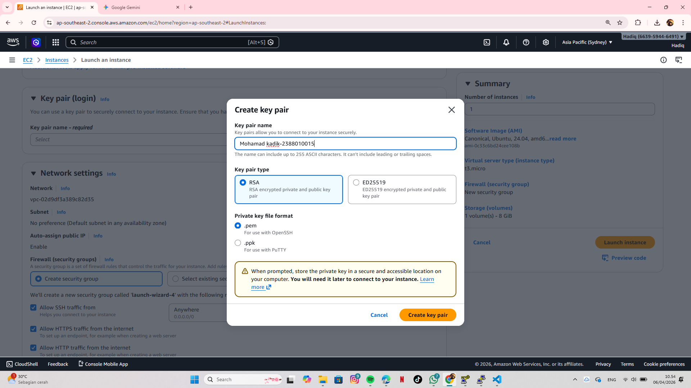
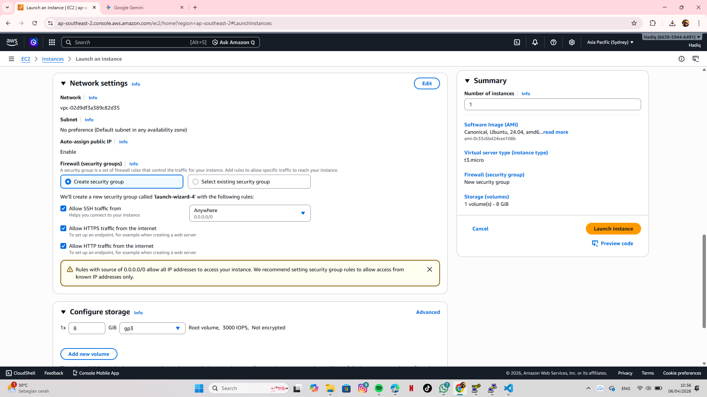
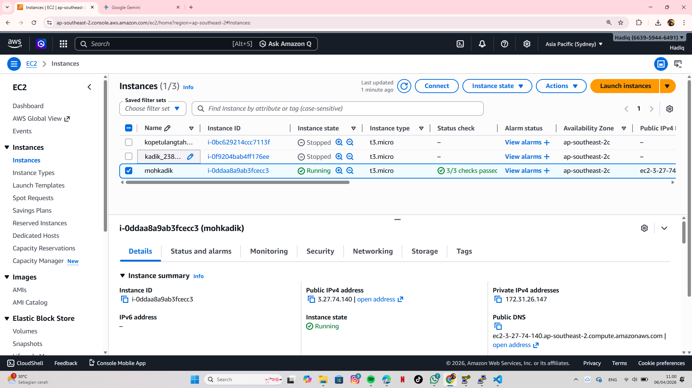

how to created ec 2 by moh.khadik

step by step
1.create our name instance and chose os ubuntu server and instand type use t.3 micro

2.created our key pair

3.next checklist our allow ssh,https and http and config our storage 8gb gp3, last click launch instance

4.succes our intances is already
